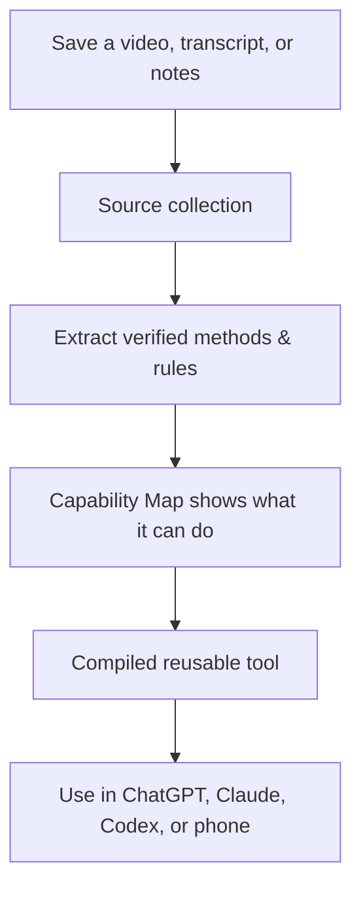

<div align="center">

# Lectic

### Save what you trust. Your AI learns the method, not just the words.

[](https://github.com/tyreamer/lectic/actions/workflows/tests.yml)
[](https://pypi.org/project/lectic/)
[](https://github.com/tyreamer/lectic/blob/main/docs/DEVELOPING.md)
[](https://github.com/tyreamer/lectic/blob/main/LICENSE)
[](#current-status)

**[Start](#start)** · **[What it does](#what-it-does)** · **[Examples](#what-you-can-build)** · **[How it works](#how-it-works)** · **[Status](#current-status)**

Works with **Claude Code** · **Codex** · **ChatGPT** · **Claude** · **Gemini CLI** · any MCP client

</div>

Most AI forgets everything the moment you close a chat. If you find a great video, lesson, or guide from someone who really knows their craft, you end up re-pasting transcripts forever or settling for generic AI advice.

Lectic fixes this. You save videos, articles, and transcripts once. Lectic turns that material into reusable tools—checklists, reviewers, diagnosis guides, and lessons—traceable back to the author's exact words. Save it once; use it across ChatGPT, Claude, Codex, Claude Code, and your phone.

## Start

**Ask your assistant to set it up.** Paste this into Claude Code, Codex, or any agent with terminal access:

> Set up Lectic for me: https://github.com/tyreamer/lectic

It reads [AGENTS.md](https://github.com/tyreamer/lectic/blob/main/AGENTS.md) and handles the rest—installs the package, hooks up MCP tools, and tests the connection. Restart when prompted, and you're ready.

**Or install it yourself:**

```bash
pip install lectic
lectic setup
```

`lectic setup` configures your local assistants automatically and offers YouTube caption support. Once set up, open your assistant anywhere and talk like a human:

> Save this for later: https://www.youtube.com/watch?v=…

> What can my saved material become?

> Use my Sourdough Baking guides to troubleshoot this loaf.

That's the entire interface. No complex commands, no re-uploading files, no prompt engineering. Run `lectic status` anytime to see what's saved and connected.

**Want to use it in ChatGPT, Claude on the web, or Gemini?** Run one command:

```bash
lectic share
```

It generates a private link you can paste into ChatGPT or Claude custom tools, or use as a phone shortcut. To keep the link active even when your laptop sleeps, you can host the server anywhere ([cloud guide](https://github.com/tyreamer/lectic/blob/main/docs/CLOUD.md)). Python 3.10+ on Windows, macOS, or Linux.

<details>
<summary>Prefer an installed skill?</summary>

The installed skill (`/lectic` in Claude Code, `$lectic` in Codex) drives the compiler directly via local file access; see [installation](https://github.com/tyreamer/lectic/blob/main/docs/INSTALLATION.md).

</details>

## What it does

- **Saving is effortless.** Drop a YouTube link, paste text, or point to a folder. Nothing is processed until you actually need it, and your notes stay attached to the source.
- **You don't need a plan upfront.** Ask what a collection can do. Lectic analyzes your material and shows you concrete tools it can build—what you give it, what you get back, and where the author's guidance ends.
- **Zero made-up advice.** Every checklist, review, and recommendation cites the exact source excerpt. When the source doesn't cover a scenario, Lectic admits it instead of hallucinating.
- **Build once, reuse everywhere.** A method built from your sourdough baking videos today troubleshoots a different bake tomorrow—in ChatGPT, Claude, Codex, or Claude Code, in any project, without re-uploading.
- **Your data stays yours.** Your knowledge lives locally in `~/.lectic`. `lectic backup` packages everything into a single file, `lectic restore` moves it to another machine, and `lectic push`/`pull` keeps an always-on instance in sync.
- **Share what you know.** Run `lectic pack "Sourdough Masterclass"` to export a collection. Anyone can run `lectic install` on it, and all of their assistants can immediately apply it ([packs guide →](https://github.com/tyreamer/lectic/blob/main/docs/PACKS.md)).

## What you can build

| Material | What Lectic builds | How you use it day-to-day |
| --- | --- | --- |
| Sourdough baking tutorials | **Loaf Troubleshooter** | Send hydration, proofing times & crumb photos → get fermentation diagnosis and next-bake fixes |
| Marathon training guides | **Training Plan Adjuster** | Send weekly mileage and fatigue level → get adjusted workout splits and recovery checks |
| Clear writing workshops | **Clarity & Tone Editor** | Send a draft email or essay → get rid of fluff, fix tone, and get punchier phrasing |
| Photography lessons | **Portrait Critic** | Send a portrait and camera settings → get focus/motion checks and a clear retake plan |

**Capabilities follow the evidence.** If your saved material lacks steps, criteria, or conditions, Lectic tells you honestly rather than inventing them. [Explore the synthetic test fixtures →](https://github.com/tyreamer/lectic/blob/main/fixtures/opportunities/README.md)

## How it works



Lectic doesn't just store bookmarks. It compiles source material into structured expertise—extracting procedures, principles, criteria, and limits. Your AI uses the compiled method directly instead of guessing or summarizing from raw text.

All knowledge lives in one folder per user (`~/.lectic`, or `LECTIC_HOME`). Every assistant and project on your machine shares the same library.

[Architecture and design details →](https://github.com/tyreamer/lectic/blob/main/DESIGN.md)

## Capture now, use later

Save things as you browse, whenever you find something genuinely useful:

> Save this sourdough video: https://youtube.com/watch?v=... Great breakdown of bulk fermentation, but ignore the Dutch oven recommendation.

Later, whenever you need help:

> Use my Sourdough Baking collection to troubleshoot why my crust turned out too hard.

Lectic stores the exact link and your note. When requested, YouTube links fetch English captions automatically (via `yt-dlp`, which `lectic setup` can install). Lectic never summarizes blindly or scrapes junk; if captions aren't available, it shows the gap clearly.

From an iPhone, use a two-step Share Sheet Shortcut to send links straight to your Lectic server ([phone guide](https://github.com/tyreamer/lectic/blob/main/docs/CLOUD.md#your-phone)).

[Capture contract, states and sync details →](https://github.com/tyreamer/lectic/blob/main/docs/CAPTURE.md)

## Current status

| Area | Available today | Boundary |
| --- | --- | --- |
| Processing | Text/transcript files and deferred YouTube English-caption retrieval | Optional `yt-dlp` required for YouTube; no arbitrary URL or audio/video acquisition |
| Discovery | Grounded, ranked Capability Maps with version history | Quality depends on source support and assistant interpretation |
| Outputs | Reusable text methods, work products, optional skill exports, shareable knowledge packs | No standalone agent runtime or persistent coaching service |
| Capture | Phone or assistant posts to `/capture`; synced-folder import; annotations and multiple memberships | Saving stores what was shared; only YouTube captions are retrieved, on request |
| Validation | Schemas, hashes, evidence references and artifact structure | Does not establish sound judgment or effectiveness |
| Evaluation | Matched prompts, structured checks and effort records | Independent runs, human review and refinement need coordination |

**Your knowledge, your server, any assistant.** Lectic is a single-user server you control—on your laptop, a container, or a home server. Your assistant handles reasoning; Lectic ensures the results are evidence-backed, reusable, and private.

## Documentation

| Guide | Purpose |
| --- | --- |
| [Installation](https://github.com/tyreamer/lectic/blob/main/docs/INSTALLATION.md) | Setup, updates and troubleshooting |
| [MCP server](https://github.com/tyreamer/lectic/blob/main/docs/MCP.md) | Connect Claude Code, Codex or any MCP client; tools and write policy |
| [Anywhere](https://github.com/tyreamer/lectic/blob/main/docs/CLOUD.md) | ChatGPT, Claude, Gemini, your phone, a second computer: one private link |
| [Packs](https://github.com/tyreamer/lectic/blob/main/docs/PACKS.md) | Share a collection as one file; install someone else's |
| [YouTube retrieval](https://github.com/tyreamer/lectic/blob/main/docs/YOUTUBE.md) | Paste links, retrieve captions on demand, preserve evidence and reuse it |
| [Guided use](https://github.com/tyreamer/lectic/blob/main/docs/GUIDED-USE.md) | See what is saved, discover concrete applications and reuse it |
| [iPhone Shortcut](https://github.com/tyreamer/lectic/blob/main/docs/iphone-shortcut.md) | Capture setup and exact first live test |
| [Evaluation](https://github.com/tyreamer/lectic/blob/main/docs/EVALUATION.md) | Compare against capable ordinary transcript chat |
| [Architecture](https://github.com/tyreamer/lectic/blob/main/DESIGN.md) | Current boundaries, storage and limitations |
| [North star](https://github.com/tyreamer/lectic/blob/main/NORTH_STAR.md) | Product direction and extensible build targets |
| [Development](https://github.com/tyreamer/lectic/blob/main/docs/DEVELOPING.md) | Code structure, tests and contribution workflow |
| [CLI reference](https://github.com/tyreamer/lectic/blob/main/docs/CLI.md) | Deterministic utilities operated by the assistant |

## Contributing

Useful contributions include reproducible failures, evidence-quality improvements and observations from real tasks. Follow the [development guide](https://github.com/tyreamer/lectic/blob/main/docs/DEVELOPING.md) and preserve the separation between source content, personal context, expertise and builds.

Run tests:

```sh
python -m unittest discover -s tests -v
```

[Report an issue](https://github.com/tyreamer/lectic/issues) with a minimal, sanitized example. Keep private corpora and client work out of public reports.

## License

[MIT](https://github.com/tyreamer/lectic/blob/main/LICENSE). Imported content retains its original ownership and licensing; a citation does not grant redistribution rights.
