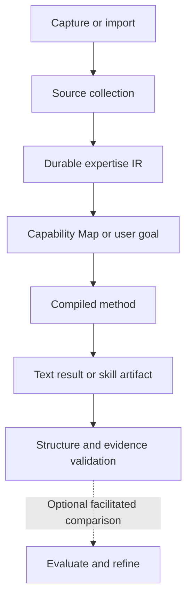

<div align="center">

# Expertise Compiler

### Turn trusted human content into reusable expertise for AI.

[](#current-status)
[](LICENSE)
[](docs/DEVELOPING.md)

**[Get started](#get-started)** · **[Examples](#what-you-can-build)** · **[Capture](#capture-now-use-later)** · **[Architecture](DESIGN.md)** · **[Testing guide](docs/testing-guide.md)**

</div>

Expertise Compiler turns useful content into structured knowledge, reasoning patterns and methods with traceable evidence. Discover what a collection can become, build a capability, and reuse the same expertise for a different goal tomorrow.

Built for developers, AI builders, consultants, creators and teams turning human methods into AI workflows.

**One collection. Multiple builds. Preserved evidence.**

> [!NOTE]
> **Alpha:** the local compiler runs through your existing Codex or Claude Code assistant. Text methods and skill exports work today. Capture has an iPhone Shortcut setup recipe. Automatic baseline execution, refinement and behavioral certification are not yet an end-to-end feature.

<a id="use-the-current-skill-interface"></a>

## Get started

You need **local Codex or Claude Code**, file and command access, and **Python 3.10+**. Your assistant handles setup and operates the compiler; no model API key or additional Python runtime packages are required.

### 1. Install the assistant interface

**In Codex, send:**

```text
Use $skill-installer to install the repository root at
https://github.com/tyreamer/expertise-compiler as a personal skill
named expertise-compiler, including its supporting files.
```

**In Claude Code, send:**

```text
Install https://github.com/tyreamer/expertise-compiler as my personal
expertise-compiler skill. Download and review the repository, then use
its bundled installer to copy the complete skill to
~/.claude/skills/expertise-compiler. Preserve any existing installation.
```

Restart the assistant if the skill does not appear. For an existing installation, follow the update guidance rather than overwriting it. [Installation and troubleshooting →](docs/INSTALLATION.md)

### 2. Bring valuable material

Supply a folder of UTF-8 `.txt`, `.md`, `.vtt` or `.srt` files. You don't need a build idea:

> Use the transcripts in ./input. Save them as My Research, show me the strongest things they could become, and recommend what to build first. Explain what I would give each one, what I would get back, and its limits.

The assistant returns a ranked **Capability Map** grounded in the collection. Each opportunity explains its purpose, inputs, outputs, supporting evidence and repeat-use value. A fact-heavy collection may support reference and learning without supporting a reliable reviewer.

### 3. Build and use it

Choose a shown opportunity:

> Build #2.

The compiler carries its evidence, boundaries and input/output contract into a reusable method. No technical artifact choice is required. Apply it to real work, or ask for a skill export when you need one.

Already know your goal? Go directly to the task:

> Use My Research to review my plan in ./plan.md. Preserve the original, save an improved version, and explain the changes using the sources.

Return in a new session in the **same project** to use the collection again. Your sources and earlier builds remain available without another upload.

## What you can build

| Material | Useful capability | Give it → get back |
| --- | --- | --- |
| Photography lessons | **Portrait Critic** | Portrait and settings → focus/motion checks and a retake plan |
| Sales training | **Discovery Call Reviewer** | Call transcript → missed questions and concrete follow-ups |
| Architecture talks | **Architecture Review Checklist** | Access-control design → scoped issues and verification steps |
| Business strategy lessons | **Market Decision Framework** | Market hypotheses → conditional comparison and missing evidence |

These examples come from small synthetic fixtures using the same generic pipeline. They illustrate supported transformations, not measured effectiveness or domain-specific product branches. [Explore the fixtures →](fixtures/opportunities/README.md)

**Capabilities follow the evidence.** If the material lacks procedures, criteria, examples or necessary conditions, the map explains the gap. A compelling title does not create expertise the sources don't contain.

## Why compile expertise?

Ordinary transcript chat can be useful. This project is designed to reduce the repeated work of turning source material into a method you can apply consistently:

- **Keep the expertise.** A durable intermediate representation survives changes in goals, assistants and output formats.
- **Inspect the reasoning.** Source statements retain evidence and stay distinct from compiler inference and personal context.
- **Apply concrete methods.** Reuse procedures, decision rules, evaluation criteria and examples on new work.
- **Preserve revisions.** Revisit sources, compare maps and create new builds without erasing earlier work or disagreements.

The advantage over ordinary chat remains a hypothesis to test. Our [pilot strategy](docs/testing-guide.md) compares quality, setup cost, corrections, reuse and voluntary return.

Digital person platforms package the person. **Expertise Compiler packages reusable pieces of the expertise.** The goal is portable methods and reasoning, with independently selectable components as the architecture evolves. [Read the north star →](NORTH_STAR.md)

## How it works



The **Expertise IR** is the durable asset. Capability Maps are versioned interpretations of it; methods and outputs are builds from it. The installed skill is one interface to the compiler, and Agent Skills is one output target. The core remains independent of a particular AI provider.

Project data lives in `.expertise-compiler/`: original sources, normalized segments, knowledge revisions, maps, private briefs and saved builds. Interrupted workflows retain checkpoints. Collections are project-local; they are not automatically available in unrelated projects.

[Architecture and remaining boundaries →](DESIGN.md)

## Capture now, use later

A collection can grow from content encountered during normal life. Save an item to **Inbox** without choosing a goal, add an optional reason for saving it, and assign it to one or more collections later.

> Save this architecture talk. Important perspective on permission boundaries, but don't treat it as company policy.

Later:

> Use my AI Architecture collection to review this design.

Capture stores supplied data without running extraction or rebuilding capabilities. Personal notes remain separate from source content. A source can belong to several collections while sharing its underlying files.

**The first phone adapter is an [iPhone Share Sheet Shortcut proof of concept](docs/iphone-shortcut.md).** It writes URL/text records to a synced folder, which the desktop imports on request. The one-time setup uses four actions; the desktop generates IDs and record metadata. It is not an installable mobile app, and real-device/iCloud testing remains outstanding.

A saved link is not retrieved content. V1 preserves URLs and supplied attachment bytes; it does not scrape social platforms, fetch article bodies, parse PDFs, perform OCR or transcribe media. Only actual supplied text and supported transcript files can feed expertise processing today.

[Capture contract, states and sync details →](docs/CAPTURE.md)

## Current status

| Area | Available today | Boundary |
| --- | --- | --- |
| Processing | Text and `.txt`, `.md`, `.vtt`, `.srt` transcripts | No automatic URL or media acquisition |
| Discovery | Grounded, ranked Capability Maps with version history | Quality depends on source support and assistant interpretation |
| Outputs | Reusable text methods, work products and optional skill exports | No standalone agent runtime or persistent coaching service |
| Capture | Local inbox import, annotations and multiple memberships | Phone adapter is a setup recipe; shared source storage requires local hard-link support |
| Validation | Schemas, hashes, evidence references and artifact structure | Does not establish sound judgment or effectiveness |
| Evaluation | Matched prompts, structured checks and effort records | Independent runs, human review and refinement need coordination |

**Local storage; your choice of assistant.** The compiler has no hosted backend or paid model API dependency. Your chosen AI service may still process content remotely and have subscription or usage limits. A plain web chat without local file/tool access cannot operate the installed compiler autonomously.

## Test the idea with us

The automated suite covers provenance, revisions, capture, discovery, builds and reuse across unrelated fixtures. Semantic fixture answers are authored test data; they are not evidence that the compiler outperforms ordinary chat.

We are testing with **AI builders, consultants, creators and knowledge-heavy professionals**. The study includes fair baseline comparisons, fresh-session reuse, source changes and refinement on unseen tasks.

**[Start with the concept-validation guide →](docs/testing-guide.md)**

## Documentation

| Guide | Purpose |
| --- | --- |
| [Installation](docs/INSTALLATION.md) | Setup, updates and troubleshooting |
| [iPhone Shortcut](docs/iphone-shortcut.md) | Capture setup and exact first live test |
| [Evaluation](docs/EVALUATION.md) | Compare against capable ordinary transcript chat |
| [Architecture](DESIGN.md) | Current boundaries, storage and limitations |
| [North star](NORTH_STAR.md) | Product direction and extensible build targets |
| [Development](docs/DEVELOPING.md) | Code structure, tests and contribution workflow |
| [CLI reference](docs/CLI.md) | Deterministic utilities operated by the assistant |

## Contributing

Useful contributions include reproducible failures, evidence-quality improvements and observations from real tasks. Follow the [development guide](docs/DEVELOPING.md) and preserve the separation between source content, personal context, expertise and builds.

Run the existing suite from a checkout:

```sh
python -m unittest discover -s tests -v
```

[Report an issue](https://github.com/tyreamer/expertise-compiler/issues) with a minimal, sanitized example. Keep private corpora and client work out of public reports.

## License

[MIT](LICENSE). Imported content retains its original ownership and licensing; a citation does not grant redistribution rights.
