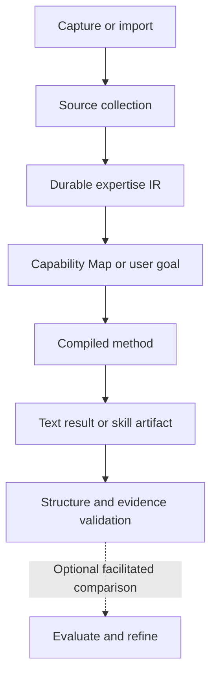

<div align="center">

# Lectic

### Save what you trust. Your AI learns the method, not just the words.

[](#current-status)
[](LICENSE)
[](docs/DEVELOPING.md)

**[Start](#start)** · **[What it does](#what-it-does)** · **[Examples](#what-you-can-build)** · **[How it works](#how-it-works)** · **[Status](#current-status)**

</div>

You watch a great talk, read a course, keep a transcript from someone who really knows their craft. Lectic turns that material into expertise your assistant can *apply*: reviewers, checklists, decision frameworks, lessons — each one traceable back to the exact words that support it. Save once; every assistant and every project on your machine can use it.

## Start

```bash
pip install git+https://github.com/tyreamer/lectic
lectic setup
```

`lectic setup` connects Claude Code and Codex if they are installed, verifies the connection, and offers YouTube support. Then open either assistant, in any folder, and talk:

> Save this for later: https://www.youtube.com/watch?v=…

> What could my saved material become?

> Use my Sales Training to review this call transcript.

That's the whole interface. No commands to learn, no goal to invent up front, nothing to re-upload later. `lectic status` shows where your knowledge lives and what is connected.

<details>
<summary>Prefer an installed skill, or using a plain ChatGPT chat?</summary>

The installed skill (`/lectic` in Claude Code, `$lectic` in Codex) drives the same compiler through your assistant's file access and remains supported; see [installation](docs/INSTALLATION.md). A plain web chat without command access cannot run Lectic yet; a hosted server is the next step ([status](#toward-portable-knowledge)). Python 3.10+ is the only requirement.

</details>

## What it does

**Saving is free.** Share a link, paste text, or point at a folder of transcripts. Nothing is processed until you want something from it, and your reason for saving stays separate from the source.

**You don't need a plan.** Ask what a collection could become and Lectic returns a ranked map of concrete jobs it can support: what you'd give it, what you'd get back, and where the evidence runs out. Pick one and it builds it.

**Results carry their evidence.** A review, a checklist, a lesson, a decision — every point cites the source passage behind it, and source statements stay distinct from the assistant's inference.

**Build once, reuse everywhere.** A method built from your Sales Training today reviews a different call tomorrow, from Codex or Claude Code, in any project, with no re-upload. Add sources later and earlier work is preserved.

## What you can build

| Material | Useful capability | Give it → get back |
| --- | --- | --- |
| Photography lessons | **Portrait Critic** | Portrait and settings → focus/motion checks and a retake plan |
| Sales training | **Discovery Call Reviewer** | Call transcript → missed questions and concrete follow-ups |
| Architecture talks | **Architecture Review Checklist** | Access-control design → scoped issues and verification steps |
| Business strategy lessons | **Market Decision Framework** | Market hypotheses → conditional comparison and missing evidence |

**Capabilities follow the evidence.** If the material lacks procedures, criteria, examples or conditions, the map says so instead of inventing them. These examples come from small synthetic fixtures and illustrate the kinds of transformation supported, not measured effectiveness. [Explore the fixtures →](fixtures/opportunities/README.md)

## How it works



The **Expertise IR** is the durable asset. Capability Maps are versioned interpretations of it; methods and outputs are builds from it. The MCP server and the installed skill are two interfaces to the same compiler, and Agent Skills is one output target. The core remains independent of a particular AI provider.

Knowledge lives in one **Lectic home** per user (`~/.lectic`, or `LECTIC_HOME`): original sources as content-addressed blobs, normalized segments, knowledge revisions, maps, private briefs and saved builds. Interrupted workflows retain checkpoints. Every project and every assistant on the machine sees the same collections. A project that already contains a `.expertise-compiler/` folder keeps using it; ask “Where does Lectic store my knowledge?” to see which applies.

[Architecture and remaining boundaries →](DESIGN.md)

## Capture now, use later

Save things as you meet them, with a reason if you have one, and sort them into collections later or never:

> Save this architecture talk. Great on permission boundaries, but don't treat it as company policy.

> Use my AI Architecture collection to review this design.

Saving stores exactly what you shared and your note, nothing more. Processing happens when a use needs it. YouTube links become English captions on request (through `yt-dlp`, which `lectic setup` offers to install); other links stay saved as links. Lectic does not fetch article bodies, parse PDFs, OCR images, scrape social platforms or transcribe audio, and an unavailable caption stays a visible gap rather than a made-up summary.

From a phone, an [iPhone Share Sheet Shortcut](docs/iphone-shortcut.md) drops captures into a synced folder that the desktop imports; posting straight to Lectic is on the roadmap below.

[Capture contract, states and sync details →](docs/CAPTURE.md)

## Current status

| Area | Available today | Boundary |
| --- | --- | --- |
| Processing | Text/transcript files and deferred YouTube English-caption retrieval | Optional `yt-dlp` required for YouTube; no arbitrary URL or audio/video acquisition |
| Discovery | Grounded, ranked Capability Maps with version history | Quality depends on source support and assistant interpretation |
| Outputs | Reusable text methods, work products and optional skill exports | No standalone agent runtime or persistent coaching service |
| Capture | Local inbox import, annotations and multiple memberships | Phone adapter is a setup recipe; captures still reach the home through a desktop import |
| Validation | Schemas, hashes, evidence references and artifact structure | Does not establish sound judgment or effectiveness |
| Evaluation | Matched prompts, structured checks and effort records | Independent runs, human review and refinement need coordination |

**Local storage today; your choice of assistant.** No hosted backend, no model API key: your assistant does the reasoning under its own subscription, and Lectic keeps the results honest and reusable.

### Toward portable knowledge

The target is one knowledge store reachable from a phone, ChatGPT, Codex and Claude Code alike, with local storage as the offline/private mode rather than the only mode. Done: one home per user behind a storage seam built for object storage ([design →](DESIGN.md#storage-one-home-cloud-shaped)), and an [MCP server](docs/MCP.md) so any client operates the compiler through validated tools. Next: a hosted store behind the same seam (which is what lets ChatGPT connect), then phone captures posted straight to it. Those are direction, not shipped features.

## Test the idea with us

The automated suite covers provenance, revisions, capture, discovery, builds and reuse across unrelated fixtures. Semantic fixture answers are authored test data; they are not evidence that the compiler outperforms ordinary chat.

We are testing with **AI builders, consultants, creators and knowledge-heavy professionals**. The study includes fair baseline comparisons, fresh-session reuse, source changes and refinement on unseen tasks.

**[Start with the concept-validation guide →](docs/testing-guide.md)**

## Documentation

| Guide | Purpose |
| --- | --- |
| [Installation](docs/INSTALLATION.md) | Setup, updates and troubleshooting |
| [MCP server](docs/MCP.md) | Connect Claude Code, Codex or any MCP client; tools and write policy |
| [YouTube retrieval](docs/YOUTUBE.md) | Paste links, retrieve captions on demand, preserve evidence and reuse it |
| [Guided use](docs/GUIDED-USE.md) | See what is saved, discover concrete applications and reuse it |
| [iPhone Shortcut](docs/iphone-shortcut.md) | Capture setup and exact first live test |
| [Evaluation](docs/EVALUATION.md) | Compare against capable ordinary transcript chat |
| [Architecture](DESIGN.md) | Current boundaries, storage and limitations |
| [North star](NORTH_STAR.md) | Product direction and extensible build targets |
| [Development](docs/DEVELOPING.md) | Code structure, tests and contribution workflow |
| [CLI reference](docs/CLI.md) | Deterministic utilities operated by the assistant |

## Contributing

Useful contributions include reproducible failures, evidence-quality improvements and observations from real tasks. Follow the [development guide](docs/DEVELOPING.md) and preserve the separation between source content, personal context, expertise and builds.

Run the existing suite from a checkout:

```sh
python -m unittest discover -s tests -v
```

[Report an issue](https://github.com/tyreamer/lectic/issues) with a minimal, sanitized example. Keep private corpora and client work out of public reports.

## License

[MIT](LICENSE). Imported content retains its original ownership and licensing; a citation does not grant redistribution rights.
